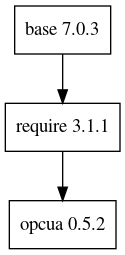

e3-opcua  
======
ESS Site-specific EPICS module : opcua


## Dependency Plot

||
| :---: |
|**Figure 1** Depdendency Tree. |


## Unified Automation OPC UA C++ SDK Configuration

* Debian OS
```
apt install libssl-dev  libxml2-dev  cmake
```

* CentOS 
```
yum install cmake3 libxml2-devel openssl-devel
```

  Check where cmake3 is, and create a symbolic link in `${HOME}`, and add PATH in `.bashrc`
```
which cmake3
ln -s /usr/bin/cmake3 ~/bin/cmake
export PATH=~/bin:$PATH
```

* Build SDK with SHARED_LIBS
```
UASDK $ ./buildSdk.sh -s ON
```


## e3 Configuration


* CONFIG_OPTIONS
```
WITH_UASDK:=$(UASDK)
WITH_UASDK_USE_XMLPARSER:=YES
WITH_UASDK_USE_CRYPTO:=YES
```
, where UASDK is the path to the Unified Automation OPC UA C++ SDK.

The original opcua epics module supports the following option in order to handle its shared libraries :
* SYSTEM   = shared libs are in a system location
* PROVIDED = shared libs are in $(UASDK_DIR)
* INSTALL  = shared libs are installed (copied) into this module
However, e3-opcua only supports INSTALL only.


## Test Server Configuration

One can download the UA OPCUA server from its own site [1]. Its configuration and running environment is found at [2]. 

## Start an IOC
```
jhlee@kaffee:~/e3-3.15.5/e3-opcua$ iocsh.bash cmds/st3.cmd 

.....

iocshLoad 'cmds/st3.cmd',''
require opcua,0.0.0
Module opcua version 0.0.0 found in /epics/base-7.0.1.1/require/3.0.4/siteMods/opcua/0.0.0/
Loading library /epics/base-7.0.1.1/require/3.0.4/siteMods/opcua/0.0.0/lib/linux-x86_64/libopcua.so
Loaded opcua version 0.0.0
Loading dbd file /epics/base-7.0.1.1/require/3.0.4/siteMods/opcua/0.0.0/dbd/opcua.dbd
Calling function opcua_registerRecordDeviceDriver
Loading module info records for opcua
epicsEnvSet(TOP, "/home/jhlee/e3-7.0.1.1/e3-opcua/cmds/..")
epicsEnvSet("SESSION",   "OPC1")
epicsEnvSet("SUBSCRIPT", "SUB1")
epicsEnvSet("OPCSERVER", "127.0.0.1")
#epicsEnvSet("OPCSERVER", "10.0.6.172")
iocshLoad("/home/jhlee/e3-7.0.1.1/e3-opcua/cmds/../iocsh/opcua.iocsh", "P=OPC:,SESS=OPC1,SUBS=SUB1,INET=127.0.0.1, DEBUG=1, SUBSDEBUG=0")
opcuaCreateSession "OPC1" "opc.tcp://127.0.0.1:48020" "1" "y"
opcuaCreateSession: successfully created session 'OPC1'
opcuaCreateSubscription "SUB1" "OPC1" "200" "0" "0"
dbLoadRecords("opcuaServerInfo.template",   "P=OPC:,R=,SESS=OPC1")
dbLoadRecords("opcuaServerStats.template",  "P=OPC:,R=,SESS=OPC1,SUBS=SUB1")
dbLoadRecords("/home/jhlee/e3-7.0.1.1/e3-opcua/cmds/../template/UaOpcUaAnsiCDemoServer.template", "P=OPC:,R=Demo:,SESS=OPC1,SUBS=SUB1")
iocInit()
Starting iocInit
############################################################################
## EPICS R7.0.1.1-E3-7.0.1.1-patch
## EPICS Base built Oct  3 2018
############################################################################
OPC UA: Autoconnecting sessions
OPC UA session OPC1: connection status changed from Disconnected to Connected
OPC UA session OPC1: (readAllNodes) beginRead service ok (transaction id 1; retrieving 34 nodes)
Session OPC1: (readComplete) getting data for read service (transaction id 1; data for 34 items)
OPC UA session OPC1: connect service ok
iocRun: All initialization complete
dbl > "/home/jhlee/e3-7.0.1.1/e3-opcua/cmds/../OPC1_PVs.list"
# Set the IOC Prompt String One 
epicsEnvSet IOCSH_PS1 "3ba7801.kaffee.12355 > "

#
3ba7801.kaffee.12439 > 

```

* Get PVs from the UaOpcUaAnsiCDemoServer.template, which is the exactly same as the substitutions file [3].

```
e3-opcua (master)$ ../caget_pvs.bash -l OPC1_PVs.list 
>> Selected PV and its value with caget
OPC:CumulatedSessionCount      84
OPC:CumulatedSubscriptionCount 84
OPC:CurrentSessionCount        4
OPC:CurrentSubscriptionCount   4
OPC:CurrentTime                2019-01-07T14:31:00.486Z
OPC:Demo:Boiler1_FillLevelSensor-RB 50
OPC:Demo:Boiler1_TemperatureSensor-RB 91.8717
OPC:Demo:BuildData             2018-10-22T10:58:07.000Z
OPC:Demo:BuildNumber           398
OPC:Demo:DynamicScalar_Double-RB 695087
OPC:Demo:DynamicScalar_Double-SP 695087
OPC:Demo:ProductName           ANSI C SDK UA Sample Server
OPC:Demo:ProductUri            urn:UnifiedAutomation:UaDemoServerAnsiC
OPC:Demo:StaticScalar_Boolean-RB true
OPC:Demo:StaticScalar_Boolean-RB_ true
OPC:Demo:StaticScalar_Boolean-SP true
OPC:Demo:StaticScalar_Byte-RB  25
OPC:Demo:StaticScalar_Byte-RB_ 25
OPC:Demo:StaticScalar_Byte-SP  25
OPC:Demo:StaticScalar_Double-RB 8.9
OPC:Demo:StaticScalar_Double-RB_ 8.9
OPC:Demo:StaticScalar_Double-SP 8.9
OPC:Demo:StaticScalar_Int16-RB -32768
OPC:Demo:StaticScalar_Int16-RB_ -32768
OPC:Demo:StaticScalar_Int16-SP -32768
OPC:Demo:StaticScalar_Int32-RB 214
OPC:Demo:StaticScalar_Int32-RB_ 214
OPC:Demo:StaticScalar_Int32-SP 214
OPC:Demo:StaticScalar_SByte-RB 127
OPC:Demo:StaticScalar_SByte-RB_ 127
OPC:Demo:StaticScalar_SByte-SP 127
OPC:Demo:StaticScalar_UInt16-RB 200
OPC:Demo:StaticScalar_UInt16-RB_ 200
OPC:Demo:StaticScalar_UInt16-SP 200
OPC:Demo:StaticScalar_UInt32-RB 4294
OPC:Demo:StaticScalar_UInt32-RB_ 4294
OPC:Demo:StaticScalar_UInt32-SP 4294
OPC:ManufacturerName           Unified Automation GmbH
OPC:ProductName                ANSI C SDK UA Sample Server
OPC:ServerState                Running
OPC:SoftwareVersion            V1.8.3 / 149ebb531cbbd67a7f48ea1509d320
OPC:StartTime                  2019-01-03T13:58:05.911Z


```

## Unified Automation Demo Server DB template

* [UA OPCUA Demo Server Template](template/UaOpcUaAnsiCDemoServer.template)
* Address Space (name space) : ```ns=4```


## Reference

[1] https://www.unified-automation.com/downloads/opc-ua-servers

[2] https://github.com/jeonghanlee/opcua-server

[3] exampleTop/DeviceDbApp/S7-1500-server.substitutions
